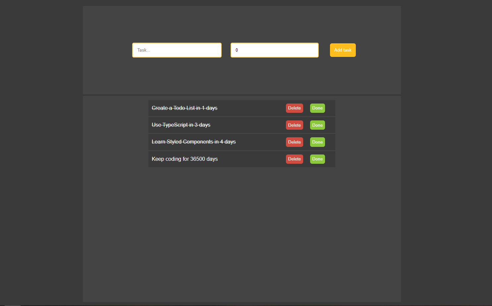

# TODO LIST

## Steps to reproduce
- Run `npm install` command in ts-todo-list folder and then `npm start` so you can go to http://localhost:3000 to view it in the browser.

## Description
- Simple Todo List project made with **ReactJS**, **TypScript** and styled with **Styled Components**
